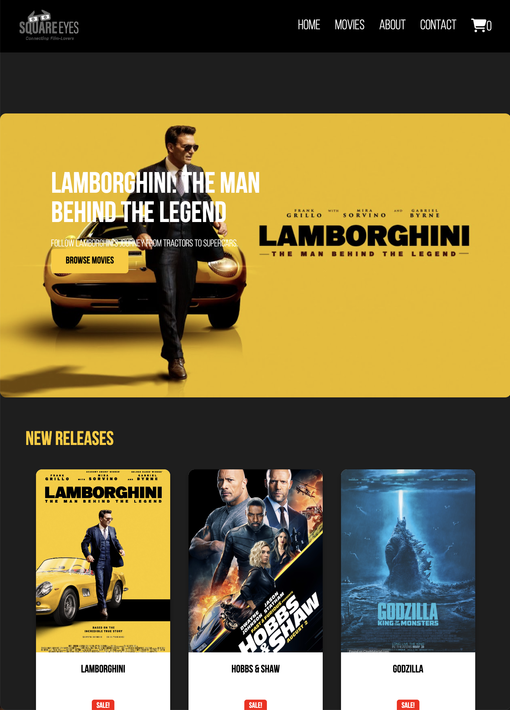

# 🎬 SquareEyes – Cross-Course Project

A front-end movie storefront using WordPress + WooCommerce as a headless CMS.  
Built as part of the Noroff Cross-Course Assignment.

---

## 🚀 Project Overview

This project fetches product (movie) data from a live WordPress WooCommerce REST API and renders it using vanilla JavaScript. It replaces any hardcoded content with real API data.

---

## 🛠️ Features

- Fetch all products via WooCommerce API
- Display product thumbnails in a grid layout
- Dynamic product detail page using query string (`?id=`)
- LocalStorage-based cart logic (no checkout required)
- Responsive layout and accessible UI

---

## 🔗 Live Links

- **GitHub Repo:** [https://github.com/ziconstr/SquareEyes](https://github.com/ziconstr/SquareEyes)
- **Live Site:** [https://cheery-sfogliatella-badfe4.netlify.app](https://cheery-sfogliatella-badfe4.netlify.app)
- **WooCommerce API Endpoint:** [https://www.nadstarr.com/wp-json/wc/store/products](https://www.nadstarr.com/wp-json/wc/store/products)

---
---

## ✅ Requirements Met

- [x] WooCommerce API live with 5+ products
- [x] Product grid from `/wp-json/wc/store/products`
- [x] Single product rendering using `?id`
- [x] DOM manipulation via JS
- [x] Error handling implemented
- [x] Unused files removed and project cleaned

---

## 📁 Folder Structure

```
📁 js/
  ├─ products.js
  ├─ product_info.js
  ├─ api.js
  ├─ cart/
  │   ├─ addToCart.js
  │   └─ renderCart.js
📁 css/
📁 images/
📄 index.html
📄 films.html
📄 product_info.html
```

---

## 📜 License

For educational use – Noroff Front-End Development Program.
